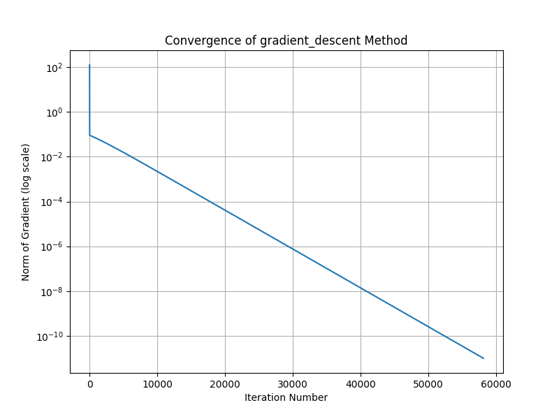
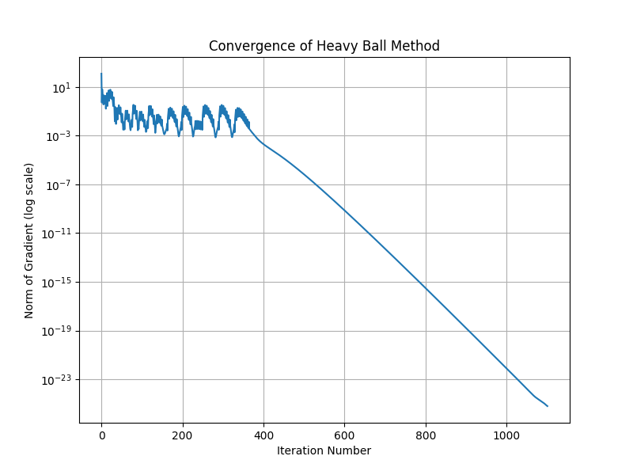
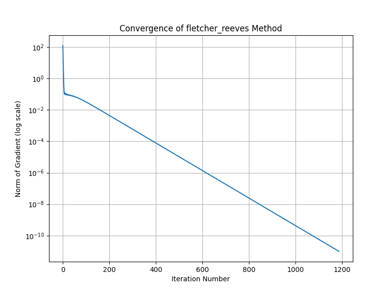

# Optimization Code: Heavy Ball Methods

## Overview
This project implements the Heavy Ball methods for optimization and analyzes its convergence behavior on a test function. This experiment focuses on ill-conditioned optimization behavior, using the Rosenbrock function.

The objective function used is:

f(x) = 100(x_2 - x_1^2)^2 + (1 - x_1)^2

This is the Rosenbrock function, a standard test problem in optimization.

---

## Purpose
The goal of this project is to study the convergence behavior of these momentum-based optimization methods and compare them against baseline methods.

---

## Methods Implemented
- Gradient (first derivative)
- Hessian (second derivative)
- Heavy Ball optimization method
- Fletcher-Reeves variant
- Convergence visualization

## Algorithm Details

The Heavy Ball method updates iterates using:

x_{k+1} = x_k - α ∇f(x_k) + β (x_k - x_{k-1})

where:
- α = step size (learning rate)
- β = momentum parameter

## Parameters

- Initial point: x0 = [1.2, 1.2]
- Tolerance: 1e-11
- Max iterations: 1e6
- Initial step size: 1e-3

## Comparison

Three variants are implemented:
- Standard Gradient Descent method
- Standard Heavy Ball method
- Fletcher-Reeves Heavy Ball method 

The Heavy Ball methods converge magnitudes faster than the standard Gradient Descent method.

## Output

The script produces:
- Iterative convergence behavior
- Trajectory of optimization
- Plots of gradient norm vs iterations (log scale)

---

## Results Summary 
| Method | Final Point | Iterations | Final Gradient Norm | 
|---|---|---:|---:| 
| Gradient Descent | [1.0, 1.0] | 58095 | 9.998e-12 | 
| Heavy Ball | [1.0, 1.0] | 1101 | 9.836e-12 | 
| Fletcher-Reeves Variant | [1.0, 1.0] | 1187 | 1.252e+02 | 

The Heavy Ball method converges significantly faster than Gradient Descent on the Rosenbrock function, requiring 1,101 iterations compared to 58,095. This demonstrates the acceleration effect of momentum-based optimization methods on ill-conditioned problems. The Fletcher-Reeves variant reaches a similar point but does not achieve a small gradient norm, indicating that it does not properly converge under the current update rule.

---

## File Structure
- `heavy_ball_convergence.py`  
  Contains:
  - function definition
  - gradient and Hessian
  - optimization algorithms
  - convergence plotting

---

## Example Output







---

## Requirements

Install dependencies:

```bash
pip install numpy matplotlib
